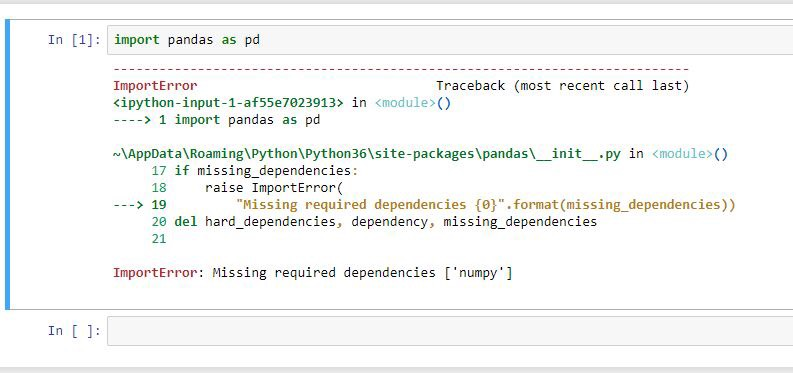

# Silabus Machine Learning (Pembelajaran Mesin)

***Bila Anda guru/dosen atau tertarik dengan desain mata kuliah ini, silakan lihat dokumen [meta](https://machine-learning-course.github.io/syllabus/meta).***

* **Mata Kuliah:** [CSH3L3, Telkom University](http://bif.telkomuniversity.ac.id/panduan-akademik/buku-kurikulum-2016/struktur-kurikulum-2016/)
* **Tim Dosen:** 
   * Suyanto
   * M. Syahrul Mubarok
   * Said Al Faraby
   * Ade Romadhony
   * Anditya Arifianto
   * Bernadus Anggo Seno Aji
   * Ema Rachmawati
   * Kurniawan Nur
   * Hendy Irawan <[hendy@hendyirawan.com](mailto:hendy@hendyirawan.com)>
* **SKS:** 3 SKS kuliah
   * 14 minggu, masing-masing:
      * Kuliah: 3 x 50 menit
      * Penugasan terstruktur: 3 x 60 menit
      * Belajar mandiri: 3 x 60 menit
* **Butuh bantuan?**
   * Cek [FAQ & Troubleshooting](#faq--troubleshooting)

## Deskripsi Mata Kuliah

Mata Kuliah Pembelajaran Mesin melatih mahasiswa untuk memahami ide dasar, intuisi, konsep, algoritma dan teknik untuk membuat komputer menjadi lebih cerdas melalui proses _learning from data_. Materi yang disampaikan meliputi _supervised learning_, _unsupervised learning_, _reinforcement learning_, dan _ensemble methods_.

* Unduh [**RPS CSH3L3 Machine Learning**](https://pandas.pydata.org/pandas-docs/stable/generated/pandas.read_csv.html)

## Capaian Pembelajaran

PLO (Programme Learning Outcomes):

1. PO7: Kemampuan menguasai konsep pengembangan sistem cerdas dalam berbagai platform (perangkat, sistem operasi dan komunikasi).
2. PO11: Kemampuan menerapkan metode, ketrampilan, dan/atau piranti teknik informatika yang terbaru yang diperlukan untuk praktik bidang informatika.

CLO (Course Learning Outcomes):

1. CLO1: Mahasiswa mampu menjelaskan konsep dari setiap metode _machine learning_.
2. CLO2: Mahasiswa mampu mengidentifikasi, memodelkan, menganalisis dan menyelesaikan permasalahan menggunakan metode-metode _machine learning_.
3. CLO3: Mahasiswa mampu mengimplementasikan metode-metode _machine learning_ menggunakan bahasa pemrograman untuk menyelesaikan permasalahan.

## Prasyarat

Mata kuliah syarat:

1. Dasar Algoritma dan Pemrograman
2. Desain dan Analisis Algoritma
3. Teori Probabilitas dan Statistika
4. Matriks Ruang dan Vektor / Aljabar Linier
5. Kecerdasan Buatan (_co-requisite_)

Pemahaman:

* Memahami cara menggunakan fitur-fitur _debugging_: Debug / Continue, Run to cursor, Step over, Step into, Step out, Breakpoint, Local variables

Bila penguasaan Anda dirasa kurang untuk konsep-konsep tersebut, disarankan untuk mereview kembali. Materi-materi prasyarat dapat dilihat di bagian [Materi Pemula](#materi-pemula).

Spesifikasi komputer:

* Komputer dengan OS Windows 7 ke atas, 32-bit/64-bit, RAM minimal 2 GB

   Anda juga dapat menggunakan macOS maupun Linux, namun perlu penyesuaian _tools_ yang digunakan.

Penguasaan _tools_ berikut sangat disarankan:

* Git dan GitHub. Pengenalan Git dan GitHub akan dilakukan saat sesi kuliah. Silakan lihat bagian [GitHub](#github) untuk rujukan lebih lanjut.

## Bahan Kajian / Pokok Bahasan

Adapun bahan kajian atau pokok bahasannya adalah:

1. Motivasi dan komponen machine learning, serta taksonomi learning pada machine learning.
2. Supervised learning:
   a. Regression
   b. Support Vector Machine
   c. Artificial Neural Networks: Multi-Layer Perceptron dan Probabilistic Neural Networks
   d. Naive Bayes
3. Unsupervised learning:
   a. Partitional-based clustering
   b. Hierarchical clustering
   c. Self-Organizing (Kohonen’s) Maps
4. Reinforcement learning
5. Ensemble methods

Kajian akan didemonstrasikan menggunakan contoh _live-code_ maupun slides yang tersedia di bawah. Latihan lebih lanjut akan dilakukan melalui tugas yang diberikan.

### Workflow

Bila Anda menggunakan GitHub Desktop, panduan umum berikut dapat membantu Anda:

* <https://guides.github.com/activities/forking/>
* <https://help.github.com/desktop/guides/contributing/>

Disarankan untuk menyalakan `Edit`->`Automatically Sync after Committing`.

Langkah-langkah pengerjaan tugas sebagai berikut:

1. Buka pranala tugas di Kaggle InClass dan/atau GitHub Classroom yang diberikan oleh dosen, Anda akan mendapatkan _repository_ khusus bagi Anda atau tim Anda untuk mengerjakan tugas.
1. _Clone repository_ tersebut ke komputer Anda.
1. Edit/Buat file utama, misal `*.ipynb` atau `*.py` menggunakan [Jupyter Notebook](http://jupyter.org) atau [PyCharm Edu](https://www.jetbrains.com/pycharm-edu/learners/).
1. Ubah program untuk menyelesaikan solusi Anda.
1. Jalankan program maupun gunakan fungsi _debugging_. Ulangi hingga sesuai harapan Anda.
1. Pastikan semua kode Anda sudah di- _commit_.
1. _Push/sync_ ke GitHub.
1. Setiap tugas memiliki jadwal _deadline_ yang sudah ditentukan. Anda tetap dapat mengirim perbaikan dan penyempurnaan sampai waktu pengirim tugas ditutup. Anda tetap dapat melakukan _push_ setelah _deadline_, namun penilaian utama diberikan pada versi yang Anda kirimkan sebelum _deadline_.

### Ketentuan

Ketentuan berikut juga berlaku di dunia nyata, lho.

* Terapkan _good programming style_ yang Anda pelajari di kelas
    * Pastikan program mudah dibaca.
        * ["Programs must be written for people to read, and only incidentally for machines to execute." -Harold Abelson](https://www.goodreads.com/quotes/9168-programs-must-be-written-for-people-to-read-and-only)
* Setiap kode yang Anda ambil dari sumber lain harus Anda cantumkan atribusi, lihat: [Plagiarisme](#plagiarisme).

## Kerangka Mata Kuliah

### Minggu ke-1

1. Pendahuluan
    * Perkenalan dosen
    * Pengantar perkuliahan:
       - Lingkup pembelajaran (Silabus/RPS)
       - Aturan perkuliahan
       - Penilaian
       - Referensi
    * Perkenalan masing-masing mahasiswa
        * Nama
        * Apa yang Anda "lakukan"?
        * Apa yang ingin Anda raih dalam mata kuliah ini?
        * Hal apa dalam pemrograman/algoritma (atau teknologi apa pun) yang Anda masih khawatir atau merasa kurang?
1. Pendahuluan Machine Learning
   - Bagaimana mesin hitung (komputer) dapat belajar?
   - Data sederhana sebagai kasus contoh untuk semua teknik learning
   - Taksonomi Teknik Learning
   - Contoh-contoh pemanfaatan/aplikasi berbasis Machine Learning
   - Keterkaitan dengan bidang-bidang lain
1. Setup
    * Berapa mahasiswa yang familiar dengan Git/GitHub?
    * Pasang [GitHub Desktop](https://desktop.github.com/)
        * Bila Anda sudah familiar dengan Git, silakan lewati bagian ini.
    * Daftar akun [GitHub](https://github.com/)
1. GitHub workflow
    * Penjelasan [workflow](#workflow)
1. Kaggle
1. Penjelasan [ketentuan](#ketentuan)

#### Referensi

* Slides: [Jyrki Kivinen. Introduction to Machine Learning.](https://www.dropbox.com/s/8mtjm5dz8u9rfkn/01%20IntroductionToMachineLearning-Jyrki.pdf?dl=0)
* [Anaconda for Windows/macOS/Linux](https://www.anaconda.com/download/) (gunakan varian Python 3.6)
* [PyCharm Edu](https://www.jetbrains.com/pycharm-edu/learners/)
* [Slides Introduction dari Pak Suyanto](http://suyanto.staff.telkomuniversity.ac.id/files/2018/01/ML-01-Introduction.pptx)

### Minggu ke-2

1. Pembahasan Tugas 0A
1. Data

   * Types of data
   * Quality of data
   * Preprocessing
   * Similarity and dissimilarity

2. Regression

   * Linear: Univariate dan Multivariate
   * Non-linear: Univariate dan Multivariate

#### Referensi

* [Introduction to residuals and least squares regression](https://www.khanacademy.org/math/engageny-alg-1/alg1-2/alg1-2d-residuals/v/introduction-to-residuals-and-least-squares-regression)
* [02 Regression: Linear Models](https://www.kaggle.com/hendyirawan/02-regression-linear-models/)
* Slides: [Jyrki Kivinen. Introduction to Machine Learning.](https://www.dropbox.com/s/8mtjm5dz8u9rfkn/01%20IntroductionToMachineLearning-Jyrki.pdf?dl=0)
* Slides [Regression](https://www.dropbox.com/s/m21tjjqw40mqedi/02%20Regression.pdf?dl=0)
* [Satu Lagi Tulisan tentang Regresi](https://tentangdata.wordpress.com/2015/05/25/satu-lagi-tulisan-tentang-regresi/)
* [Simple Linear Regression - Bagian 1](https://tentangdata.wordpress.com/2015/06/07/simple-linear-regression-bagian-1/)
* Slides Regression dari Pak Suyanto: [PDF](http://suyanto.staff.telkomuniversity.ac.id/files/2018/01/ML-02-Regression.pdf) | [PowerPoint](http://suyanto.staff.telkomuniversity.ac.id/files/2018/01/ML-02-Regression.pptx)

### Minggu ke-3

Naive Bayes:

- Naive Bayes Classifier: Discrete and Continous Attributes

#### Referensi

* Slides [Bapak Anditya's slide](https://drive.google.com/file/d/1x0nJ9fnJVZhd6QFQh0bHeigi-MLd_TQD/view)
* [Cerita Tentang Bayesian Probability](https://tentangdata.wordpress.com/2016/03/01/apakah-daryl-seorang-bayesian/)
* [Naive Bayes for Non-text Data](https://www.dropbox.com/s/yf1fppd8mob0ini/03a%20NaiveBayes_for_NonTextData.ppt?dl=0)
* [Naive Bayes for Text Data](https://www.dropbox.com/s/t5u4o47s3upewmg/03b%20NaiveBayes_for_TextData.pptx?dl=0)
* [Slides Naive Bayes dari Pak Suyanto](http://suyanto.staff.telkomuniversity.ac.id/files/2018/02/ML-03-Naive-Bayes.pptx)

### Minggu ke-4

Artificial Neural Networks:

- Multi-Layer Perceptron dengan Backpropagation learning

#### Referensi

* [Slides ANN-MLP](https://www.dropbox.com/s/ga43clihtinwg85/04a%20ANN-MLP.pptx?dl=0)
* [Slides ANN-MLP & PNN dari Pak Suyanto](https://www.dropbox.com/s/4p7frktuv5l5c0o/ML%2004%20ANN-MLP%20%26%20PNN.pptx?dl=0)

#### Daftar materi referensi tentang ANN yang bagus (via Bu Ade Romadhony 😆)

* [Video kuliah pengantar ANN oleh Geoffrey Hinton](https://www.youtube.com/watch?v=cbeTc-Urqak&index=1&list=PLoRl3Ht4JOcdU872GhiYWf6jwrk_SNhz9)
* [A Gentle Introduction to Artificial Neural Networks](https://theclevermachine.wordpress.com/2014/09/11/a-gentle-introduction-to-artificial-neural-networks/)
* [Sejarah ANN](http://www.adreykurenkov.com/writing/ai/a-brief-history-of-neural-nets-and-deep-learning/)
* [Hacker's Guide to Neural Networks](http://karpathy.github.io/neuralnets/)
* [Artikel tentang kenapa harus belajar backpropagation](https://medium.com/@karpathy/yes-you-should-understand-backprop-e2f06eab496b), sementara sekarang sudah banyak tools/API/library yang tinggal dipakai.
* [Artikel tentang backpropagation](http://colah.github.io/posts/2015-08-Backprop/), snippet text:

   > When I first understood what backpropagation was, my reaction was:
   >
   > “Oh, that’s just the chain rule! How did it take us so long to figure out?”" 😁

### Minggu ke-5

Artificial Neural Networks:

- Probabilistic Neural Networks

#### Referensi

* [Video Probabilistic Neural Networks](https://www.dropbox.com/s/xrx2vz64v62mn2l/04b%20Probabilisitic%20Neural%20Networks.mp4?dl=0)
* [Probabilistic Neural Networks 1: SimpleOCR](https://www.kaggle.com/hendyirawan/probabilistic-neural-networks-simpleocr)
* [Probabilistic Neural Networks 2: Smoothing Effect](https://www.kaggle.com/hendyirawan/probabilistic-neural-networks-smoothing-effect)
* [Slides ANN-MLP & PNN dari Pak Suyanto](https://www.dropbox.com/s/4p7frktuv5l5c0o/ML%2004%20ANN-MLP%20%26%20PNN.pptx?dl=0)

### Minggu ke-6

Support Vector Machine:

- Binary Class SVM: Linearly separable data dan non-linearly separable data

#### Referensi

* [Slides Support Vector Machine](https://www.dropbox.com/s/j7hgl0e3gfig350/05%20Support_Vector_Machine.pdf?dl=0)

### Minggu ke-7

Support Vector Machine:

- Multi Class SVM: Linearly separable data dan Nonlinearly separable data

#### Referensi

* [Slides Support Vector Machine](https://www.dropbox.com/s/j7hgl0e3gfig350/05%20Support_Vector_Machine.pdf?dl=0)

### Minggu ke-8

1. Konsep clustering
2. Proximity measure antar cluster:
   - Single-link
   - Complete-link
   - Group average
   - Centroid-based

#### Referensi

* [Slides Clustering](https://www.dropbox.com/s/f17ir1omu99n5io/06%20UnsupervisedLearning-Clustering.pdf?dl=0)
* [Hierarchical Clustering 3: single-link vs. complete-link](https://www.youtube.com/watch?v=VMyXc3SiEqs)
* [Proximity measures](https://www.dropbox.com/s/dibb3nymgg12pvd/06%20Proximity%20measures.jpg?dl=0)
* [Slides Pak Anditya Arifianto](http://anditya.staff.telkomuniversity.ac.id/academic/ml/)
* [Slides Pak Suyanto](https://www.dropbox.com/s/h0wfj93mhruwyj8/ML%2008-10%20k-Means%2C%20Aglomerative%2C%20and%20SOM%2003.pptx?dl=0)
* [Slides GAB02 Kelompok E](https://github.com/csh3l3-2017b/0b-sharing-is-caring-gab02_e)
* [Slides IF02 Kelompok E](https://github.com/csh3l3-2017b/0b-sharing-is-caring-if02_e)

### Minggu ke-9

3. Partitional-based clustering (K-means):
   - pseudocode,
   - objective function,
   - pengaruh inisialisasi centroid.
4. Hierarchical clustering:
   - dendrogram representation,
   - nested clusters representation,
   - divisive dan agglomerative approach

#### Referensi

* [Slides Clustering](https://www.dropbox.com/s/f17ir1omu99n5io/06%20UnsupervisedLearning-Clustering.pdf?dl=0)
* [Slides Pak Suyanto](https://www.dropbox.com/s/h0wfj93mhruwyj8/ML%2008-10%20k-Means%2C%20Aglomerative%2C%20and%20SOM%2003.pptx?dl=0)
* [Slides Pak Anditya Arifianto](http://anditya.staff.telkomuniversity.ac.id/academic/ml/)
* [Slides GAB02 Kelompok F](https://github.com/csh3l3-2017b/0b-sharing-is-caring-gab02_f)
* [Slides IF02 Kelompok F](https://github.com/csh3l3-2017b/0b-sharing-is-caring-if02_f)

### Minggu ke-10

Self-Organizing (Kohonen’s) Maps

#### Referensi

* [Self-Organizing Map](https://www.dropbox.com/s/2kleilsebg3rsay/10%20-%20Self-Organizing%20Map.pptx?dl=0)
* [Slides Pak Suyanto](https://www.dropbox.com/s/h0wfj93mhruwyj8/ML%2008-10%20k-Means%2C%20Aglomerative%2C%20and%20SOM%2003.pptx?dl=0)
* [Slides IF-39-02 Kelompok G](https://github.com/csh3l3-2017b/0b-sharing-is-caring-if02_g)
* [Slides IF-41-GAB02 Kelompok G](https://github.com/csh3l3-2017b/0b-sharing-is-caring-gab02_g_som)

### Minggu ke-11

Reinforcement Learning:

* Markov Decision Processes
* Bellman Equations

#### Referensi

* [ReinforcementLearning.zip](https://www.dropbox.com/s/ydld66fs2bk5x1o/07%20ReinforcementLearning.zip?dl=0)
* [Reinforcement Learning slides Pak Anditya](https://www.dropbox.com/s/9o0qsc5bzuzxo7t/11%20-%20Reinforcement%20Learning.pptx?dl=0)
* [Slides IF-39-02 Kelompok H](https://github.com/csh3l3-2017b/0b-sharing-is-caring-if02_h)
* [Slides IF-41-GAB02 Kelompok H](https://github.com/csh3l3-2017b/0b-sharing-is-caring-gab02_h)

### Minggu ke-12

Reinforcement Learning:

* Value Iteration and Policy Iteration
* Q-Learning

#### Referensi

* [ReinforcementLearning.zip](https://www.dropbox.com/s/ydld66fs2bk5x1o/07%20ReinforcementLearning.zip?dl=0)
* [Reinforcement Learning slides Pak Anditya](https://www.dropbox.com/s/9o0qsc5bzuzxo7t/11%20-%20Reinforcement%20Learning.pptx?dl=0)
* [Slides IF02 Kelompok H](https://github.com/csh3l3-2017b/0b-sharing-is-caring-if02_h)
* [Slides Q-learning](https://www.dropbox.com/s/mxd9yhc2acwymhc/Q-learning.ppt?dl=0)
* [Q-learning by Sutton](https://www.dropbox.com/s/pmzd20x8gk3tm60/Q-learning%20Sutton.pdf?dl=0)
* [Materi IF-39-02 Kelompok I](https://github.com/csh3l3-2017b/0b-sharing-is-caring-if02_i)
* [Materi IF-41-GAB02 Kelompok I](https://github.com/csh3l3-2017b/0b-sharing-is-caring-team_i_reinforcement_learning)

### Minggu ke-13

Ensemble Methods (Metode-metode Gabungan):

1. Bagging (voting for classification, averaging for regression).
2. Boosting

#### Referensi

* [Slides Ensemble Methods](https://www.dropbox.com/s/0o7y41axqjd5531/08%20ensemble_sdm10.pptx?dl=0)
* [EnsembleMethods.zip](https://www.dropbox.com/s/ihb3jswikumzmj0/08%20EnsembleMethods.zip?dl=0)
* [Materi IF-39-02 Kelompok J](https://github.com/csh3l3-2017b/0b-sharing-is-caring-if02_j)
* [Materi IF-41-GAB02 Kelompok J](https://github.com/csh3l3-2017b/0b-sharing-is-caring-gab02_j)
* [Bootstrap aggregating / bagging video - Udacity](https://www.youtube.com/watch?v=2Mg8QD0F1dQ)
* [Bagging example video - Udacity](https://www.youtube.com/watch?v=sVriC_Ys2cw)
* [Boosting video - Udacity](https://www.youtube.com/watch?v=GM3CDQfQ4sw)
* [Ensemble Methods in Machine Learning: What are They and Why Use Them?](https://towardsdatascience.com/ensemble-methods-in-machine-learning-what-are-they-and-why-use-them-68ec3f9fef5f)
* [Ensemble Learning to Improve Machine Learning Results](https://blog.statsbot.co/ensemble-learning-d1dcd548e936)

### Minggu ke-14

Ensemble Methods (Metode-metode Gabungan):

3. Random Forests

#### Referensi

* [Slides Ensemble Methods](https://www.dropbox.com/s/0o7y41axqjd5531/08%20ensemble_sdm10.pptx?dl=0)
* [EnsembleMethods.zip](https://www.dropbox.com/s/ihb3jswikumzmj0/08%20EnsembleMethods.zip?dl=0)
* [Materi IF-39-02 Kelompok K](https://github.com/csh3l3-2017b/0b-sharing-is-caring-if02_k)
* [Materi IF-41-GAB02 Kelompok K](#notyet)
* [Random Forest - Fun and Easy Machine Learning](https://www.youtube.com/watch?v=D_2LkhMJcfY)

## Tugas-tugas

### Tugas 0A "TelU Legends Heroes": Kelas IF-39-02 dan IF-41-GAB02

1. Bergabung dengan grup LINE/WhatsApp. Pranala akan diberikan saat sesi kuliah.
2. [Lengkapi profil GitHub Anda.](https://github.com/settings/profile)
3. Mendaftar paket [GitHub Student Developer Pack](https://education.github.com/pack)
4. Membuat akun [Kaggle](https://www.kaggle.com)
5. Lengkapi profil Kaggle Anda
6. [**TelU Legends Heroes**](https://www.kaggle.com/c/heroes)

### Tugas 0B "Sharing is Caring": Kelas IF-39-02 dan IF-41-GAB02

1. Buatlah 11 kelompok dalam satu kelas. Untuk IF-39-02: 3-4 orang per kelompok. Untuk IF-41-GAB02: 2-3 orang per kelompok.
   * Pembagian kelompok harus sudah fix per Jumat 2 Feb 2018 pukul 16:00 WIB. Dengan cara mencantumkan NIM & Nama masing-masing anggota di dalam file `README.md` Git repository kelompok yang disediakan GitHub Classroom di pranala berikut: [https://classroom.github.com/g/X7g_IYVb](https://classroom.github.com/g/X7g_IYVb) . Saat membuat nama kelompok di GitHub Classroom prefix dengan kelasnya, contoh: `IF02_A` (kelas IF-39-02 kelompok A), `GAB02_A` (kelas IF-41-GAB02 kelompok A).
2. Setiap kelompok membuat rangkuman sesuai bagiannya, dan dipresentasikan oleh semua anggota kelompok sesuai jadwal
   * **Sumber materi bebas** (boleh dari referensi di silabus maupun yang lain)
   * **Format materi bebas** (slide, Word, animasi, video, interaktif, web based, Python notebook, live coding, ...)
   * File-file materi presentasi sudah di-_push_ ke repository GitHub Classroom kelompok maksimal sebelum perkuliahan dimulai (pada jadwal kelompok tersebut)
   * Presentasi tiap kelompok max 30 menit, tiap anggota wajib presentasi di sub-bagian tertentu, **yang tidak presentasi nilai 0**
   * Diskusi / _sharing_ materi diperbolehkan dan dianjurkan

Pembagian materi dan jadwal presentasi kelompok:

* Kelompok A (Minggu ke-4): Artificial Neural Networks - Multi-Layer Perceptron dengan Backpropagation learning
   * [Presentasi IF-39-02 (Farhan, Maulana, Melinda, Reza)](https://github.com/csh3l3-2017b/0b-sharing-is-caring-if02_z)
   * [Presentasi IF-41-GAB02 (Amran, Adnan)](https://github.com/csh3l3-2017b/0b-sharing-is-caring-gab02_a)
* Kelompok B (Minggu ke-5): Artificial Neural Networks - Probabilistic Neural Networks
* Kelompok C (Minggu ke-6): Support Vector Machine - Binary Class SVM
* Kelompok D (Minggu ke-7): Support Vector Machine - Multi Class SVM
* Kelompok E (Minggu ke-8): 1. Konsep clustering; 2. Proximity measure antar cluster
* Kelompok F (Minggu ke-9): 3. Partitional-based clustering (K-means); 4. Hierarchical clustering
* Kelompok G (Minggu ke-10): Self-Organizing (Kohonen’s) Maps
* Kelompok H (Minggu ke-11): Reinforcement Learning: Markov Decision Processes, Bellman Equations
* Kelompok I (Minggu ke-12): Reinforcement Learning: Value Iteration and Policy Iteration, Q-Learning
* Kelompok J (Minggu ke-13): Ensemble Methods (Metode-metode Gabungan): Bagging, Boosting
* Kelompok K (Minggu ke-14): Ensemble Methods (Metode-metode Gabungan): Random Forests

### Tugas 1.1

* [Tugas 1.1 - Kelas IF-39-02 dan IF-41-GAB02](assignment-1-1-hiw)

### Tugas 1.2

* [Tugas 1.2](https://maclearnme.wixsite.com/mysite)
   * Soal unik sesuai NIM
   * _Deadline_: Selasa tanggal 20 Februari 2018 pukul 21.00 WIB

### Tugas 1.3

* [Tugas 1.3 Jaringan Saraf Probabilistik - Kelas IF-39-02 dan IF-41-GAB02](https://www.kaggle.com/t/f1063f60fe3e4230a1592f100698aa72)

### Tugas 1.4

* [Tugas 1.4 Support Vector Machine - Kelas IF-39-02 dan IF-41-GAB02](assignment-1-4-hiw)

## Pustaka

### Pustaka Utama

1. Peter Flach: Machine learning: The Art and Science of Algorithms that Make Sense of Data. Cambridge University Press 2012
2. Tan, Steinbach, Kumar. Introduction to Data Mining. Addison-Wesley. 2006.
3. Slide perkuliahan: Introduction to Machine Learning, University of Helsinki.
4. Suyanto, Data Mining untuk Klasifikasi dan Klasterisasi Data, INFORMATIKA: Bandung, 2017.

###	Pustaka Pendukung

1. Mitchell M. Tom, 1997, Machine Learning. McGraw Hill, International Editions. Printed in Singapore. Last Edition
2. Nils. J. Nilson, 1998, Intoduction to Machine Learning, Department of Computer Science, Standford University, Last Edition
3. Silakan lihat daftar referensi untuk masing-masing topik

### Materi Pemula

Agar dapat memahami mata kuliah ini dengan lancar, Anda perlu menguasai dasar algoritma dan pemrograman.
Kapan pun Anda membutuhkannya, silakan manfaatkan referensi berikut...

* [Dasar Algoritma dan Pemrograman](http://dedetarwidi.staff.telkomuniversity.ac.id/lectures/dasar-algoritma-dan-pemrograman/) oleh [Dede Tarwidi, S.Si., M.Si., M.Sc.](http://dedetarwidi.staff.telkomuniversity.ac.id/)

### Tools

#### Tools Utama

Anda dapat memilih _tools_/bahasa pemrograman yang paling cocok untuk masalah yang dihadapi:

* Python 3.x (**disarankan**). Installer: [Anaconda with Python 3.x](https://www.anaconda.com/download/).
   * [Jupyter Notebook](http://jupyter.org/) (termasuk dalam instalasi Anaconda)
     * [MathJax Basic Tutorial and Quick Reference](https://math.meta.stackexchange.com/questions/5020/mathjax-basic-tutorial-and-quick-reference)
   * [PyCharm Edu](https://www.jetbrains.com/pycharm-edu/learners/)
   * Library yang penting: [pandas](https://pandas.pydata.org/pandas-docs/stable/10min.html), [numpy](https://docs.scipy.org/doc/numpy-dev/user/quickstart.html), [matplotlib](https://matplotlib.org/tutorials/introductory/pyplot.html)
   * Tutorial singkat python dan numpy: [Stanford CNN course Python-Numpy Tutorial](http://cs231n.github.io/python-numpy-tutorial/)
   * [NumPy Quickstart Tutorial - SciPy](https://docs.scipy.org/doc/numpy-dev/user/quickstart.html)
   * [NumPy Array Tutorial - DataCamp](https://www.datacamp.com/community/tutorials/python-numpy-tutorial)
   * [NumPy Cheat Sheet - DataQuest](https://www.dataquest.io/blog/numpy-cheat-sheet/)
   * [NumPy Cheat Sheet - DataCamp](https://www.datacamp.com/community/blog/python-numpy-cheat-sheet)
* Java
   * [Java Development Kit (JDK)](www.oracle.com/technetwork/java/javase/downloads/index.html)
   * [IntelliJ IDEA](https://www.jetbrains.com/idea/)
* [GNU Octave](https://www.gnu.org/software/octave/
)
* C/C++ Compiler dan IDE: [Code::Blocks](http://www.codeblocks.org) (termasuk GCC/G++ compiler dan GDB debugger dari [TDM-GCC](http://tdm-gcc.tdragon.net/))
   * Alternatif: [Eclipse for C++ Development](https://www.eclipse.org/) + GCC/G++ compiler dan GDB debugger dari [TDM-GCC](http://tdm-gcc.tdragon.net/)

      Bila menggunakan Eclipse di Windows, agar project dapat dieksekusi:

      1. Klik kanan di _project_ > Properties
      2. Pilih C/C++ Build:

          Ganti _Build command_ menjadi: `mingw32-make`

      3. Pilih C/C++ Build > Settings > Binary Parsers:

         Centang: Windows PE
* Pascal
* [MATLAB](https://www.mathworks.com/products/matlab.html). 

#### Tools Pendukung

* unit testing: [Python unittest](https://docs.python.org/3/library/unittest.html)
* berbagi kode: [gist.github.com](https://gist.github.com/)
* tanya jawab: [Stack Overflow](http://stackoverflow.com/)
* Visualisasi:

   * [TensorFlow Playground](https://playground.tensorflow.org/)
   * [VisuAlgo](https://visualgo.net/en) (struktur data)

* Machine learning libraries

   **Perhatian:** Anda tidak diperkenankan menggunakan library-library tersebut saat mengerjakan tugas. Namun, Anda dapat membandingkan hasil keluaran program yang Anda buat dengan hasil library tersebut, sehingga membuat Anda lebih menguasai machine learning. Bila ingin berkarir sebagai Data Scientist, menguasai setidaknya satu library machine learning menjadi syarat utama.

   * [Gluon](https://mxnet.incubator.apache.org/gluon/index.html) - Engine: [MXNet](https://mxnet.incubator.apache.org/)
   * [Keras](https://keras.io) - Engine: [TensorFlow](https://www.tensorflow.org) / [Microsoft Cognitive Toolkit](https://www.microsoft.com/en-us/cognitive-toolkit/)
   * [scikit-learn](http://scikit-learn.org/)

#### GitHub

* Git and GitHub
    * [Official GitHub Help](https://help.github.com/)
    * [Recommended resources](http://hackerhours.org/resources.html#github)
    * [Student Developer Pack](https://education.github.com/pack)
* [Download Git](https://git-scm.com/downloads)
* GUI Client: [GitHub Desktop](https://desktop.github.com/)
   * Alternatif: [TortoiseGit](https://tortoisegit.org/), [SourceTree](https://www.sourcetreeapp.com/), [GitHub Desktop](https://desktop.github.com/), [GitKraken](http://gitkraken.com/)

### Latihan Soal & Komunitas Data Science

* [Kaggle](https://www.kaggle.com)
* [Data Science Indonesia](https://datascience.or.id)

   Bila Anda berminat untuk berkarir di bidang AI, machine learning, atau data science, sangat disarankan untuk aktif di Kaggle dan bergabung dengan komunitas Data Science Indonesia, ada grup Telegram juga lho yang cukup ramai. 😊

* [HackerRank](https://www.hackerrank.com/)
* [HackerEarth](https://www.hackerearth.com/)
* [CodeChef](https://www.codechef.com/)

### Kompetisi Bidang Informatika

Mengikuti kompetisi dapat mengasah kemampuan Anda dan meningkatkan masa depan karir Anda, di samping _rewards_ yang menarik tentunya.

* [Kaggle Competitions](https://www.kaggle.com/competitions)
* [CodeChef](https://www.codechef.com/)
* [Microsoft Imagine Cup](https://imagine.microsoft.com/en-us/Country/Details/ID)
* [Google Summer of Code](https://summerofcode.withgoogle.com/)

## Pembobotan Nilai

* Tugas 1 (Mandiri) - 30%
* Tugas 2 (Mandiri) - 30%
* Tugas 3 (Mandiri) - 20%
* Tugas 4 (Mandiri) - 20%
* Tugas 0 Series - bonus maksimal +20 points untuk memperbaiki nilai Tugas 1 & Tugas 2

## Distribusi Nilai

| Indeks | Rentang        |
|--------|----------------|
| A      | >= 80.01       |
| AB     | 80.01 .. 80.00 |
| B      | 65.01 .. 70.00 |
| BC     | 60.01 .. 65.00 |
| C      | 50.01 .. 60.00 |
| D      | 40.01 .. 50.00 |
| E      | <= 40.00       |

## Plagiarisme

Bagi yang melakukan kecurangan/plagiarism nilainya akan diturunkan sesuai dengan tingkat plagiarismenya.

Dimohon menghargai ketentuan penggunaan dan/atau lisensi dari kode apa pun yang Anda temukan, dan apabila Anda mengimplementasikan atau menduplikasi sebuah algoritma atau kode dari sumber lain, cantumkan kredit/atribusi ke sumber berbentuk komentar dalam kode.

## FAQ & Troubleshooting

Untuk _troubleshooting_ pemrograman, Anda dapat mencari/bertanya di [StackOverflow](https://stackoverflow.com/).
Untuk _troubleshooting_ AI, machine learning, dan data science, silakan berdiskusi di [Kaggle](https://www.kaggle.com/).

Bila pertanyaan Anda baru/belum terjawab, silakan kirimkan pranala _thread_ StackOverflow/Kaggle Anda ke grup kelas dan in syaa Allah dosen akan bantu menjawab.

### ImportError

**Anggi Yuniar Putri**: Sya sudah install anaconda nya pak, download pythonnya juga sudah
Kenapa ya saat ngetik jupyter notebook di anaconda promtnya ga keluar pak

**Hendy Irawan**: ImportError berarti ada package atau module yg belum terinstall di "environment" Python kita

Ini sangat umum terjadi sehari2, misalnya bila adik2 mencoba code Python dari internet yang butuh package tertentu dan belum terinstall, maka adik2 perlu meng-install dulu

Ada 2 alternatif: 

1. Pakai `conda`.
2. Pakai `pip`.

Bedanya apa?

1. `conda` biasanya digunakan utk package yg "bawaan" dari Anaconda.

   Nah dlm kasus dik @anggiyuniarputri harusnya pandas dan numpy itu udah include, tp entah kenapa ga muncul.

   So silakan dik @anggiyuniarputri coba:

   A. Jalankan _Anaconda Prompt_ as Administrator

   B. Ketik:

       conda install numpy

   Pastikan konek internet. Semoga berhasil ya 😊

   PS: Untuk memastikan semua package bawaan Anaconda terinstall dengan baik, bisa coba:

       conda install anaconda

2. `pip` ini lebih sering digunakan daripada conda.

   Kalau instalasi Anaconda kita lengkap dan butuh package tertentu, biasanya yg digunakan adalah `pip`.
   Secara sederhana cara pakainya:

       pip install (namapackage)

   Di kuliah ini kyny teman2 jarang bertemu dengan pip. Karena semua library yg dibutuhkan sudah built-in di Anaconda: pandas, numpy, matplotlib. Tapi bila adik2 kreatif misal bikin web atau nyobain libraries machine learning (gluon, keras, sklearn, tensorflow, mxnet) maka pakai pip untuk menginstallnya. (Recommended bagi yg bercita2 jd Data Scientist, dan bs jadi penilaian untuk Tugas 0 juga ya)

### Jupyter Notebook vs PyCharm Edu

**Regy**: python nya dianjurkan pake Anaconda/Jupyter Notebook pak ? atau pake pycharm edu jg boleh? 

**Hendy Irawan**: pythonnya baiknya tetep install Anaconda. Alasannya krn dia udah include banyak libraries penting untuk data science.

PyCharm IDEnya saja. Silakan pas bikin programnya pakai PyCharm, tapi pas ngumpulin dibuat juga notebooknya ya. Dgn format notebook sy lebih cepat bs menilainya dibandingkan source code saja. Krn di notebook ada dokumentasi, source code, dan hasil eksekusi muncul dlm satu tempat, sy menilainya lebih cepat dan adik2 juga lebih cepat tau nilainya jg 😀

### train.csv?

**Farhan** file train digunakan untuk apa ya?

**Hendy Irawan**: itu buat contoh format saja.
kalo yg dipakai untuk submission berdasarkan data dari test.csv ya

jadi biasanya di dunia data science, data itu dibagi training data dan testing.
awalnya kita membuat model machine learning dengan training data, biasanya hanya sebagian kecil, lalu kita utak-atik sampai hasil performance-nya bagus.

lalu bila modelnya udah "setengah matang", kita uji dengan data test untuk memastikan performanya benar2 oke (tidak overfitting). bila oke, maka sistemnya kita deploy ke production dan dapat dipakai.

kenapa dipisah gitu.. selain agar kita tidak "bias", juga untuk menghemat waktu. kalau samplenya ada puluhan ribu atau bahkan jutaan, maka mentraining semuanya sekaligus akan membutuhkan waktu lama sekali saat pembuatan model. jadinya kita ambil sebagian dulu, gt deh.

### Python 2.7?

**Redha Juanda**: maaf pak, python nya apakah wajib versi 3.6? saya sudah terinstall versi 2.7

**Hendy Irawan**: boleh 2.7 jg kalo memang sudah terbiasa.
tp mungkin ada fitur atau library yg bermanfaat di python 3.6 (misal: [TensorFlow](https://www.tensorflow.org/install/install_windows#requirements_to_run_tensorflow_with_gpu_support)), yg sayang juga kalau tidak dicoba.
tapi overall, tidak ada masalah

## Ucapan Terima Kasih

Struktur mata kuliah dan pemanfaatan GitHub berdasarkan [Advanced JavaScript](https://github.com/advanced-js/syllabus) oleh Aidan Feldman.
