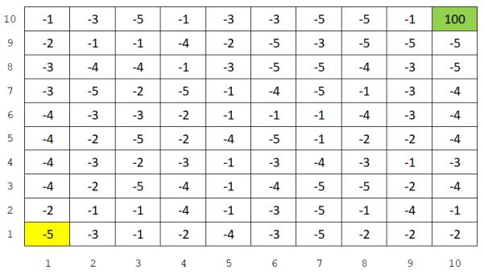

# Pembelajaran Mesin

Semester Genap Tahun Akademik 2017-2018

Tugas 3: Q-learning

Tim Dosen

April 20, 2018

## Instruksi Umum

Bangunlah sebuah sistem _Q-learning_ untuk menemukan _optimum policy_ sehingga
_Agent_ yang berada di posisi _Start_ (1,1) mampu menemukan _Goal_ yang berada di posisi (10,10) dengan
mendapatkan **Total Reward** maksimum pada grid world dalam Figure 1 berikut ini. Data pada Figure
1 dapat dilihat di file [`DataTugasML3.txt`](DataTugasML3.txt). Pada kasus ini, _Agent_ hanya bisa melakukan empat aksi: N,
E, S, dan W yang secara berurutan menyatakan North (ke atas), East (ke kanan), South (ke bawah), dan
West (ke kiri). Anda boleh menggunakan skema apapun dalam mengimplementasikan sebuah _episode_.

Figure 1: Sebuah grid world ukuran 10 x 10, di mana angka-angka dalam kotak menyatakan reward.
Agent berada di posisi Start (1,1) dan Goal di posisi (10,10)

## Instruksi Khusus

* Bangun sistem Q-learning menggunakan bahasa pemrograman yang Anda kuasai: Matlab, Python, Java, C++, dsb.;
* Saat pengujian, sistem harus mampu membaca file [`DataTugasML3.txt`](DataTugasML3.txt) dan menghasilkan sebuah keluaran berupa **Total Reward** (yang didapatkan oleh Agent selama bergerak dari Start ke Goal);
* Tuliskan laporan Anda dalam bentuk file PDF (*.pdf) atau Jupyter Notebook (*.ipynb);
* Selalu cantumkan Nama, NIM, dan Kelas di dalam file jawaban Anda (laporan dan source code);
* Kumpulkan hasil pengerjaan Anda (seluruh source code yang dibutuhkan) ke dalam GitHub Classroom Repository yang Anda dapatkan di [https://classroom.github.com/a/rKkztg2a](https://classroom.github.com/a/rKkztg2a) ;
* Jawaban dikirimkan sebelum Jumat tanggal 27 April 2018 pukul 21.00 WIB. Penalty 10 poin per jam untuk keterlambatan;
* **Segala bentuk kecurangan sangat dilarang.**

## Poin Penilaian

* Source code program dengan penjelasan yang lengkap dan detail (30%)
* Laporan berisi analisis masalah, desain, dan evaluasi hasil eksperimen (50%)
* Akurasi dihitung berdasarkan total reward yang didapatkan oleh Agent selama bergerak dari posisi Start ke posisi Goal (20%)

## Asisten Dosen

IF-39-02/IF-41-GAB02: Satrio / prabowo.satrioadi@gmail.com / +62878-2101-3849 / HIW
